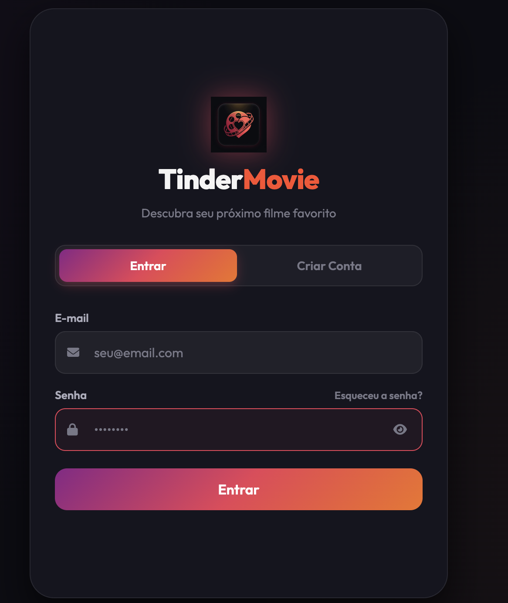
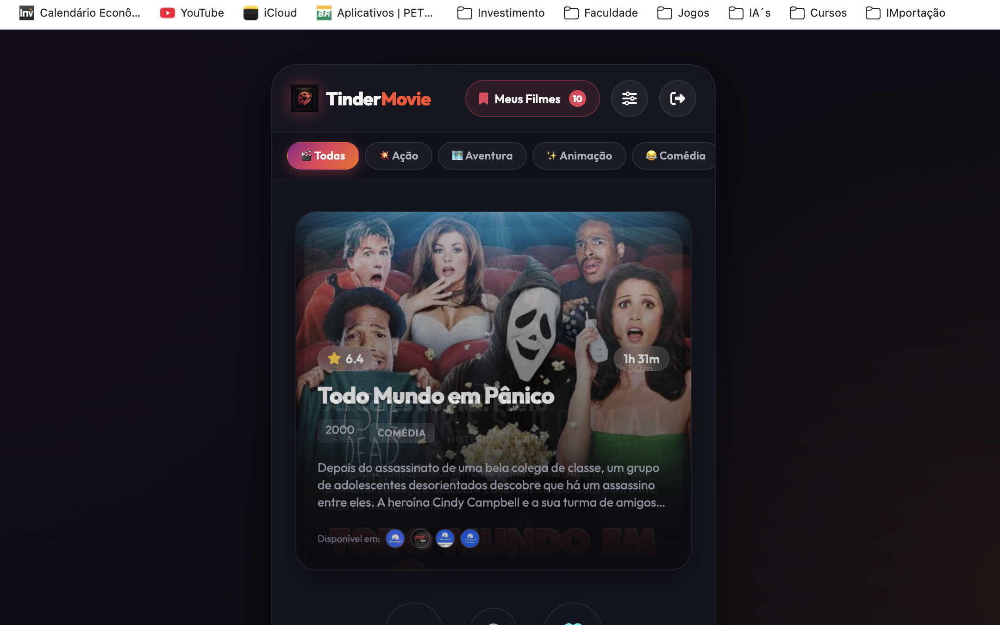
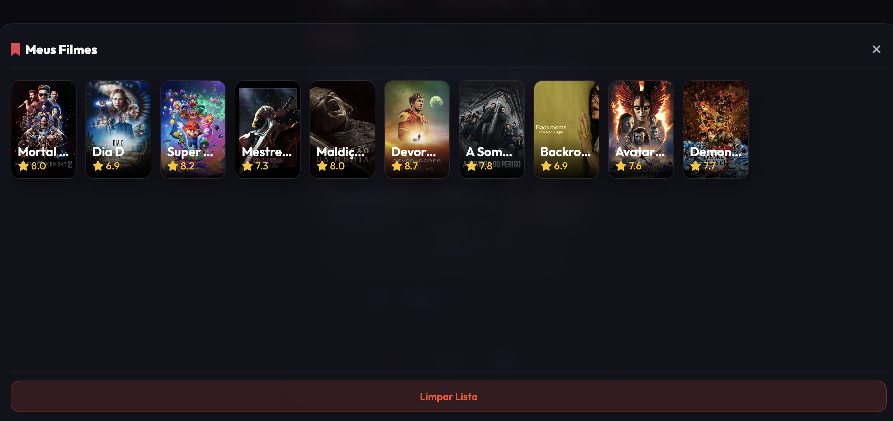

<div align="center">


# TinderMovie

**Descubra seu próximo filme favorito — um swipe de cada vez.**

[](https://developer.mozilla.org/en-US/docs/Web/HTML)
[](https://developer.mozilla.org/en-US/docs/Web/CSS)
[](https://developer.mozilla.org/en-US/docs/Web/JavaScript)
[](https://supabase.com)
[](https://www.themoviedb.org)

</div>

---

## Sobre o Projeto

**TinderMovie** é uma aplicação web de descoberta de filmes inspirada na mecânica de swipe do Tinder. O usuário vê um card por vez com pôster, nota, descrição e onde o filme está disponível — e decide em segundos: curtiu ou passou. Os filmes curtidos formam uma lista personalizada, e o sistema aprende com suas escolhas ao longo do tempo.

---

## Telas do Aplicativo

### 1 — Login

<div align="center">
  
</div>

Acesso seguro com e-mail e senha. Conta com alternância entre **Entrar** e **Criar Conta**, campo de senha com toggle de visibilidade e link para redefinição de senha.

---

### 2 — Descoberta de Filmes

<div align="center">
  
</div>

A tela principal exibe um deck de cards com filmes. Cada card mostra:

- Pôster em alta resolução
- Nota e duração
- Título, ano e gênero
- Sinopse resumida
- Logos dos serviços de streaming onde o filme está disponível

A navegação por gênero no topo permite filtrar rapidamente por categorias como Ação, Aventura, Animação e Comédia.

---

### 3 — Meus Filmes

<div align="center">
  
</div>

Painel com todos os filmes curtidos, organizados em grade com pôster e nota. Inclui opção de limpar a lista completa.

---

## Como Funciona

```
Usuário faz login
      │
      ▼
Sistema carrega filmes via TMDB API
      │
      ▼
Cards são exibidos um a um
      │
      ├── Swipe direito (❤️ curtiu) ──► Salvo na watchlist
      │
      └── Swipe esquerdo (✕ passou) ──► Ignorado / aprendizado
                    │
                    ▼
         Perfil de preferências atualizado
                    │
                    ▼
         Próximas sugestões mais precisas
```

---

## Arquitetura

O projeto é uma **Single Page Application (SPA)** em HTML, CSS e JavaScript puro — sem frameworks. A estrutura segue a arquitetura **A.N.T.**:

| Camada | Responsabilidade |
|--------|-----------------|
| **A** — Auth & State | Autenticação de usuário e estado global da aplicação |
| **N** — Navigation & Core | Lógica de deck, swipe, filtros e categorias |
| **T** — Third-party & Data | Integração com APIs externas e persistência de dados |

---

## Integrações Externas

### 🎬 TMDB — The Movie Database
> [themoviedb.org](https://www.themoviedb.org)

Fonte de todos os dados cinematográficos da aplicação: pôsteres, sinopses, notas, duração, gêneros, elenco e informações de disponibilidade em plataformas de streaming por região.

### 🔐 Supabase
> [supabase.com](https://supabase.com)

Backend como serviço responsável por:
- **Autenticação** de usuários (e-mail + senha)
- **Banco de dados** PostgreSQL para persistência da watchlist
- **Sincronização** do histórico de swipes entre sessões

---

## Estrutura do Projeto

```
TinderMovie/
├── src/
│   ├── index.html          # App principal
│   ├── login.html          # Tela de autenticação
│   ├── reset-password.html # Redefinição de senha
│   ├── app.js              # Lógica core da aplicação
│   ├── index.css           # Estilos do app
│   ├── login.css           # Estilos da autenticação
│   ├── supabase-client.js  # Configuração do cliente Supabase
│   └── config.js           # Configuração das APIs (não versionado)
├── docs/
│   └── screenshots/        # Capturas de tela do app
└── README.md
```

---

## Funcionalidades

- [x] Autenticação com e-mail e senha
- [x] Deck de filmes com mecânica de swipe
- [x] Filtro por gênero via barra de categorias
- [x] Exibição de streaming disponível por filme
- [x] Watchlist persistida no banco de dados
- [x] Sincronização entre sessões e dispositivos
- [x] Perfil de recomendação adaptativo
- [x] Filtros avançados (ano, nota, duração, streaming)

---

<div align="center">

Feito com ❤️ e muito swipe

</div>
