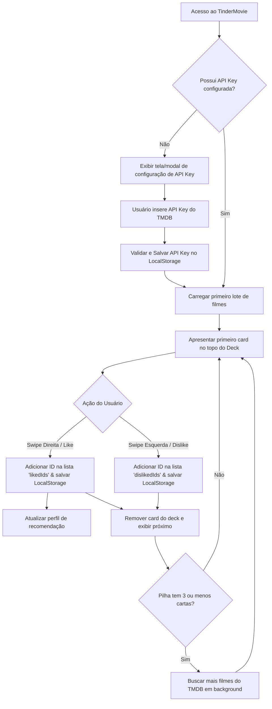

# 📜 Project Constitution: TinderMovie

## 🎬 Visão Geral do Projeto
O **TinderMovie** é uma aplicação web responsiva (com foco principal em Mobile First) concebida para auxiliar usuários a descobrirem novos filmes de forma rápida e divertida. Utilizando um sistema de cartas empilhadas ("cards stack") e gestos de deslizar ("swipes"), o usuário expressa interesse (swipe para a direita) ou desinteresse (swipe para a esquerda) por um filme apresentado por vez.

---

## 🏗️ Arquitetura Proposta

O TinderMovie será desenvolvido como um **Single Page Application (SPA)** rodando inteiramente do lado do cliente (client-side), sem necessidade de um backend dedicado neste MVP.

### Diretórios e Camadas (Estrutura A.N.T.)
Conforme as diretrizes técnicas do projeto, a estrutura organizacional será a seguinte:
```plaintext
├── gemini.md                 # Project Constitution & Data Schemas
├── task_plan.md              # Controle de fases e checklist do B.L.A.S.T.
├── findings.md               # Pesquisas de APIs e especificações técnicas
├── progress.md               # Histórico de progresso e testes
├── architecture/             # Camada 1: SOPs técnicos (Standard Operating Procedures)
│   ├── SOP_TMDB_client.md    # Como chamar, filtrar e formatar dados do TMDB
│   ├── SOP_deck_state.md     # Controle de estado do deck de cartas, swipes e histórico
│   └── SOP_recommendation.md # Lógica do motor de ranqueamento simples
├── tools/                    # Camada 3: Scripts Python de automação/utilidades locais
└── src/                      # Código-fonte do frontend (HTML, CSS e JavaScript Vanilla)
```

- **Persistência**: Toda a persistência é feita localmente utilizando a API do **LocalStorage**.
- **Consumo de Filmes**: Comunicação direta e assíncrona do cliente com a API do **TMDB v3/v4** via Fetch API.
- **Motor de Recomendação**: Algoritmo em JavaScript rodando no cliente para calcular a prioridade de exibição dos filmes com base nas frequências de gêneros curtidos.

---

## 📊 Data Schemas (TypeScript Shapes)

Abaixo estão definidos os tipos estruturais (Shapes JSON) que serão utilizados no desenvolvimento do sistema.

### 1. UserPreferences
Armazena preferências visuais e de localização do usuário no navegador.
```typescript
interface UserPreferences {
  theme: 'dark' | 'light';
  language: string; // Padrão: 'pt-BR'
  region: string;   // Padrão: 'BR'
}
```

### 2. FilterSettings
Contém os parâmetros de busca que o usuário pode configurar para alterar o deck de filmes.
```typescript
interface FilterSettings {
  genres: number[];           // IDs dos gêneros do TMDB (ex: [28, 12])
  minReleaseYear: number | null;
  maxReleaseYear: number | null;
  minVoteAverage: number;     // De 0 a 10 (ex: 7.0)
  maxRuntime: number | null;  // Limite de tempo em minutos
  providers: number[];        // IDs dos provedores de streaming (ex: [8, 119])
}
```

### 3. StreamingProvider
Objeto detalhado do provedor de streaming.
```typescript
interface StreamingProvider {
  id: number;
  name: string;
  logoUrl: string;
  displayPriority: number;
}
```

### 4. Movie
Modelo completo do filme, processado após o retorno da API do TMDB.
```typescript
interface Movie {
  id: number;
  title: string;
  overview: string;
  posterUrl: string;
  backdropUrl: string;
  releaseYear: number;
  voteAverage: number;
  genres: string[];
  genreIds: number[];
  runtime: number; // Duração em minutos
  trailerUrl: string | null; // URL incorporável (YouTube) ou null
  streamingProviders: StreamingProvider[];
}
```

### 5. MovieCard
Modelo simplificado contendo apenas os dados necessários para a renderização do Card na interface do usuário.
```typescript
interface MovieCard {
  id: number;
  title: string;
  overviewSummary: string; // Sinopse truncada/resumida
  posterUrl: string;
  releaseYear: number;
  voteAverage: number;
  genres: string[];
  runtimeText: string;     // Ex: "2h 15min" ou "98min"
  trailerUrl: string | null;
  providersLogos: string[]; // URLs prontas de logotipos dos provedores de streaming disponíveis no BR
}
```

### 6. SwipeAction
Representa o evento disparado quando o usuário realiza um swipe em uma carta.
```typescript
interface SwipeAction {
  movieId: number;
  action: 'like' | 'dislike';
  timestamp: number; // Unix timestamp
}
```

### 7. Watchlist (Histórico e Persistência)
Representa o estado persistido no LocalStorage que lista o que o usuário já interagiu.
```typescript
interface Watchlist {
  likedIds: number[];      // Cache de IDs curtidos (para verificação instantânea)
  dislikedIds: number[];   // Cache de IDs rejeitados (para verificação instantânea)
  history: SwipeAction[];  // Histórico ordenado cronologicamente de todas as ações de swipe
}
```

### 8. RecommendationProfile
Objeto gerado dinamicamente para orientar o motor de ranqueamento dos novos cards a serem inseridos na pilha.
```typescript
interface RecommendationProfile {
  likedGenresFrequency: Record<number, number>; // genreId -> quantidade de curtidas
  averageVoteOfLiked: number;                    // Média de nota dos filmes curtidos
  preferredYears: number[];                     // Anos mais recorrentes nos filmes curtidos
}
```

---

## ⚙️ Behavioral Rules (Regras de Comportamento)

### O sistema NUNCA deve:
1. **Mostrar filmes repetidos**: Um filme que já recebeu swipe (seja Curtido ou Rejeitado) não deve ser reinserido na pilha de forma alguma.
2. **Exibir cards com informações críticas ausentes**: Se o filme do TMDB não tiver título, poster, ou sinopse (overview), ele deve ser ignorado silenciosamente no processamento do deck.
3. **Bloquear a interface**: O processo de carregar novos filmes da API em segundo plano deve ser assíncrono e transparente, de modo que o usuário nunca tenha sua interação travada.

### O sistema SEMPRE deve:
1. **Priorizar o carregamento antecipado (Pre-fetching)**: Quando a pilha de cards estiver com 3 ou menos filmes restantes, o sistema deve disparar silenciosamente uma nova busca no TMDB para obter mais filmes.
2. **Aplicar filtros rígidos**: O deck gerado deve respeitar estritamente os filtros de gênero, nota, ano e streaming definidos em `FilterSettings`.
3. **Exibir estados vazios claros**: Se não houver mais resultados retornados pelo TMDB após os filtros aplicados, o deck deve exibir uma mensagem indicando o fim da pilha e oferecer botões rápidos para redefinir filtros.
4. **Gerenciar erros de API**: Caso o TMDB falhe ou a API Key esteja ausente/inválida, exibir um modal solicitando a configuração ou indicando problema de conexão.

---

## 🏗️ Architectural Invariants (Restrições e Padrões Técnicos)

1. **Estado Único do Deck**: Toda a lógica de qual carta está sendo exibida, a ordem da pilha, e a transição do swipe deve ser gerenciada por um módulo centralizado (sem dispersão de estado no DOM).
2. **Camada de Adaptação de Dados**: Nenhum dado bruto retornado do TMDB deve ser injetado diretamente na UI. Deve passar sempre por um adaptador que transforma a resposta da API em uma instância do tipo `Movie` e, posteriormente, em um formato de visualização do tipo `MovieCard`.
3. **Persistência Síncrona Segura**: Atualizações no LocalStorage das chaves `watchlist` e `user_preferences` devem acontecer imediatamente após cada ação de swipe ou mudança de filtros, garantindo que o estado não seja perdido se a aba for fechada repentinamente.

---

## 🔄 Fluxos de Usuário



---

## 📝 Maintenance Log
*Histórico de estabilidade e manutenção de longo prazo.*

- **2026-06-14**: Criação e aprovação do Blueprint Inicial do TinderMovie, definindo data schemas e as regras de negócio iniciais de swipes e filtros.
